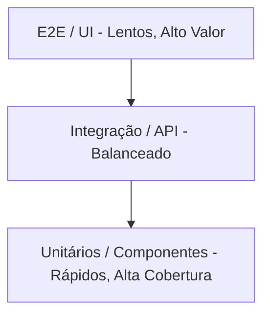

# 🧪 Guia de Testes e Estratégia de QA — `tester.com`

Bem-vindo ao guia de Qualidade e Testes do projeto `tester.com`. Este documento detalha a nossa **Cultura de Qualidade**, a **Estratégia da Pirâmide de Testes**, o ferramental utilizado, e serve como referência para desenvolvedores e QAs garantirem confiabilidade, escalabilidade e previsibilidade em cada entrega.

---

## 🎯 Nossa Cultura de Qualidade (QA)

A qualidade neste projeto não é uma etapa final, mas um processo contínuo integrado em todo o Ciclo de Vida de Desenvolvimento de Software (SDLC). 
Nosso objetivo é:
- **Shift-Left Testing:** Antecipar testes e validações para as fases iniciais do desenvolvimento.
- **Feedback Rápido:** Fornecer aos desenvolvedores feedback imediato sobre seus commits usando testes estáticos e unitários.
- **Redução de Regressões:** Garantir de forma automatizada que refatorações não quebrem fluxos de negócio críticos (E2E).
- **Cobertura de Código Efetiva:** Exigir `80%` como threshold de segurança para aprovação de PRs.

---

## 🧱 A Pirâmide de Testes do Projeto

Nossa estratégia baseia-se na tradicional **Pirâmide de Testes**, adaptada para o ecossistema Web (React + Node.js). Ela define a proporção ideal entre os diferentes tipos de teste:


*(Nota: Imagine uma pirâmide cuja base é ampla e o topo estreito).*

### 1. Base (Testes Unitários & Componentes) — Grande Volume
- **Foco:** Validar unidades isoladas de código (funções, hooks arbitrários do React, utilitários, e renderização isolada de componentes UI).
- **Características:** Rapidez extrema, isolamento de dependências externas via *mocks* (Banco de Dados, chamadas de rede API externas).
- **Ferramentas:** Vitest, Testing Library React.

### 2. Meio (Testes de Integração & API) — Volume Moderado
- **Foco:** Validar o contrato e a resposta da API do backend. Testar como as peças individuais reagem em conjunto.
- **Características:** Não necessitam de interface de usuário (DOM). Conectam-se ao banco de dados via seeds limpos.
- **Ferramentas:** Playwright API Testing.

### 3. Topo (Testes End-to-End - E2E UI) — Baixo Volume (Cruciais)
- **Foco:** Ponta-a-ponta. Validar jornadas críticas de negócio que geram valor (Login, Cadastro de Produto, Carrinho de Compras).
- **Características:** Lentos e sujeitos a instabilidades de rede (flakiness). Simulam o navegador real consumindo a API real e o banco de dados.
- **Ferramentas:** Playwright UI.

---

## 🧰 Stack Tecnológica de QA

As ferramentas foram escolhidas buscando sinergia com o frontend em Vite e paralelismo.

### Nível Unitário
- **Vitest:** Engine principal para testes rápidos. Desenhado para projetos baseados no `Vite`.
- **@testing-library/react:** Para testes de renderização com foco na perspectiva do usuário (Queries genéricas como `getByRole`).
- **jsdom:** Emulador DOM em ambiente Node para permitir que os testes rodem fora do navegador.
- **@vitest/coverage-v8:** Relatórios detalhados da cobertura estrutural do código.

### Nível Integração & E2E
- **Playwright Oficial (@playwright/test):** Motor central cross-browser corporativo para simular navegação em Chromium, WebKit e Firefox.
- **@faker-js/faker:** Geração de massa de dados imprevisível ou pseudo-randômica para cadastro (garante robustez do sistema, prevenindo hardcodes).

---

## ⚡ Vitest no Projeto (Deep Dive)

O **Vitest** atua como nossa espinha dorsal para *Shift-Left Testing*.

### Como o Utilizamos
O Vitest roda contra o diretório `src/__tests__/` ou em arquivos com sufixo `*.spec.jsx` diretamente ao lado da implementação.

**Comportamentos esperados:**
- Subir de forma rápida e testar a renderização simulada de componentes.
- Atender obrigatoriamente a régua (Threshold) de **80%** em `lines`, `functions`, `branches`, e `statements`. *A pipeline falhará caso seu novo código diminua a cobertura geral para baixo deste indexador.*

### Comandos de Dia a Dia
```bash
npm run test:unit      # Roda tudo uma única vez e para. Ideal para Pré-Commit/CI.
npm run test:watch     # Continua rodando observando qualquer mudança de arquivo(s) - TDD.
npm run test:coverage  # Levanta o suite e produz a pasta de relatório coverage/.
npm run test:ui        # Levanta uma interface explorando os testes e reports visuais.
```

---

## 🎭 Playwright no Projeto (Deep Dive)

Utilizado para a garantia de qualidade através da simulação fiel das jornadas do cliente em um ambiente completo.

**Principais Definições (`playwright.config.ts`):**
- **Execução Paralela Completa:** Assegura redução dramática no tempo de QA nas Pipelines.
- **Ambientes (Workers/Retries):** CI roda 3 *workers* em paralelo com retentativas duplas nos pontos falhos. O uso local levanta até 7 *workers* com 1 tentativa.
- **Captura Forense Completa em Falhas:** Se o E2E falhar, o Playwright vai armazenar, para auditoria:
  - `screenshot` da quebra;
  - `video` com a gravação da cena que falhou;
  - `trace` contendo logs de rede, ações e DOM de cada instante.

### Comandos de Dia a Dia
```bash
npm run test:e2e           # Execução Headless silenciosa.
npm run test:e2e:ui        # Execução pelo console interativo UI do Playwright.
npm run test:e2e:debug     # Modo Debugger em tempo real.
npm run test:e2e:report    # Mostra o relatório final HTML Playwright na porta local.
```

---

## ▶️ Como Executar o Ecossistema Completo 

Para garantir a ausência de *false-positives*, você precisa rodar toda a stack conectada antes das rotinas de E2E.

### 1) Suba a infraestrutura
```bash
docker compose up -d       # Inicia o DB (PostgreSQL)
```

### 2) Prepare o Backend (API) e Banco
```bash
cd server
npm install
npm run seed               # Semeia a base de dados zerada (Pré-requisito crítico).
npm run dev                # Dev Next rodando na porta 3001
```

### 3) Prepare o Frontend e lance os Testes
Em outro terminal, na raiz principal:
```bash
npm install
npm run dev                # Vite subindo servidor DEV na porta 5174.

# Para validar tudo de uma vez
npm run test:unit
npm run test:e2e
```

---

## 🤖 Pipeline CI/CD (GitHub Actions)

O processo está consolidado na rotina automatizada (`.github/workflows/e2e-pipeline.yml`).

Nenhuma code integration deve ir a `main` ou ser mergeada se apresentar falhas nas verificações corporativas. A esteira da nossa CI performa em matriz paralela o seguinte:
1. Executa unit testes e avalia falha em relação à meta de **80% de Cobertura**.
2. Disparo Playwright em Matrix de 3 browsers simulados no Headless (Chromium, Edge, Webkit) e validadores de API.

---

## 📊 Relatórios e Dashboards (GitHub Pages)

Acompanhe os resultados diários, a cobertura e a documentação pública disponibilizada usando **GH-Pages** através dos nossos relatórios:

- 📑 **Todos os Testes (Índice):** [Visualizar Relatórios Gerais](https://reinaldorossetti.github.io/tester.com/tests-report/)
- 📘 **Documentação Swagger (API):** [Swagger UI](https://reinaldorossetti.github.io/tester.com/tests-report/swagger/index.html)
- 🧪 **Cobertura de Unitários/Unidade (Vitest):** [Unit Tests Coverage](https://reinaldorossetti.github.io/tester.com/tests-report/unit-tests/coverage/index.html)
- 🔌 **Relatório de Testes de API:** [Playwright API Report](https://reinaldorossetti.github.io/tester.com/tests-report/playwright-report-api/index.html)

**📱 Relatórios UI E2E (Playwright por Browser):**
- 🌐 [Relatório Frontend - Chromium](https://reinaldorossetti.github.io/tester.com/tests-report/playwright-report-frontend-chromium/index.html)
- 🌐 [Relatório Frontend - WebKit](https://reinaldorossetti.github.io/tester.com/tests-report/playwright-report-frontend-webkit/index.html)
- 🌐 [Relatório Frontend - Edge](https://reinaldorossetti.github.io/tester.com/tests-report/playwright-report-frontend-edge/index.html)

---

## 📂 Organização Prática das Pastas (Mapa)

```text
📁 src/__tests__/          -> Suítes para lógicas de Frontend da Web em Vitest.
📁 e2e/specs/frontend/     -> Cenários Playwright validando a tela e fluxo de UI E2E.
📁 e2e/specs/api/          -> Cenários Playwright validando respostas JSON puras.
📁 server/tests/api/       -> (Node backend) Testes nativos Unit e API do backend.
📁 test-results/           -> [AUTO-GERADO] Repositório local dos relatórios da falha (video/image).
📁 playwright-report/      -> [AUTO-GERADO] Dashboard html do sucesso das runs de E2E do Playwright.
📁 coverage/               -> [AUTO-GERADO] Dashboard html das métricas do unitário pelo Vitest.
```

---
*Dúvidas de manutenção? Consulte os arquivos de configuração raiz: `vitest.config.js` e `playwright.config.ts`. A Engenharia de Qualidade (QA) é uma responsabilidade compartilhada por todos da equipe. Mantenha os padrões e desenvolva aplicações seguras.*